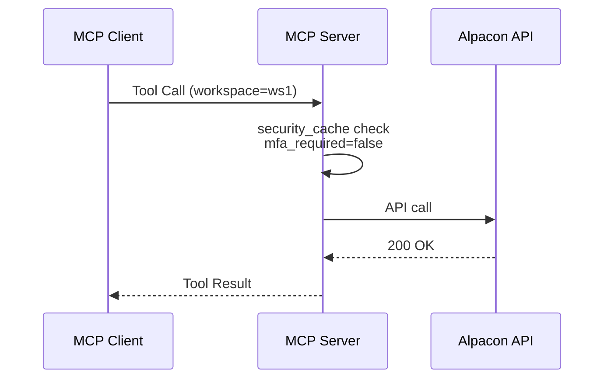
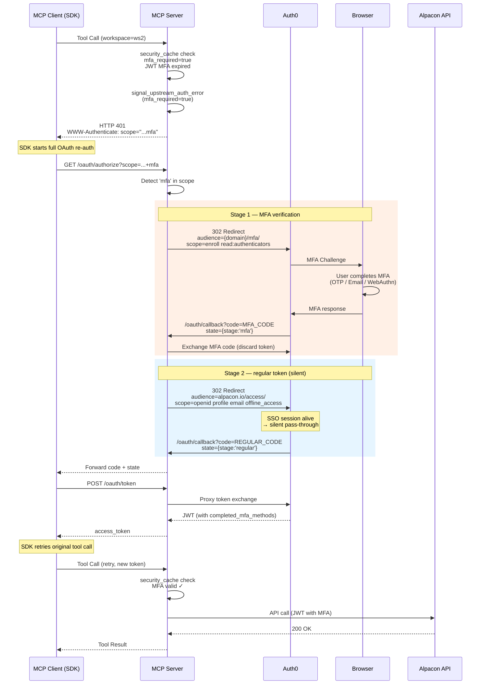
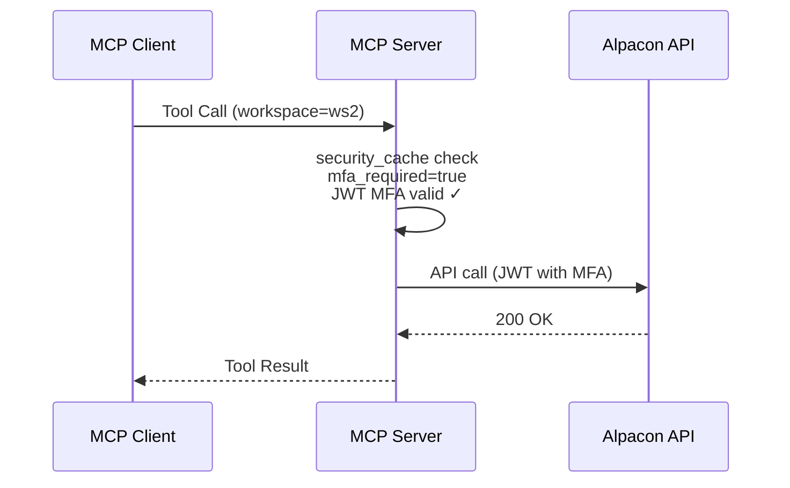

# MFA re-authentication flow for MCP server

This document describes how the MCP server handles workspace-level MFA requirements using a two-stage OAuth flow.

## Overview

Some Alpacon workspaces require MFA for sensitive actions (websh, webftp, command). The MCP server proactively detects this by caching workspace security settings from the account service, and triggers a two-stage OAuth flow when MFA is needed.

## Flow diagrams

### Case 1: MFA not required

### Case 2: MFA required, not yet completed

### Case 3: MFA required, already completed (cache hit)

## Key components

| Component | File | Role |
|-----------|------|------|
| Security settings cache | `utils/security_settings.py` | Caches workspace MFA settings from account service |
| MFA pre-check | `utils/decorators.py` | Checks MFA before API call, signals 401 if needed |
| Auth error middleware | `utils/auth_error_middleware.py` | Adds `mfa` scope to WWW-Authenticate on 401 |
| OAuth proxy (authorize) | `utils/oauth.py` | Routes to MFA or regular audience based on scope |
| OAuth proxy (callback) | `utils/oauth.py` | Handles two-stage callback (MFA → regular) |

## Configuration

| Environment variable | Description | Example |
|---------------------|-------------|---------|
| `ALPACON_ACCOUNT_URL` | Account service base URL | `https://account.alpacax.com` |
| `AUTH0_MFA_AUDIENCE` | Auth0 MFA API audience | `https://{domain}/mfa/` |
| `AUTH0_NAMESPACE` | JWT custom claim namespace | `https://alpacon.io/` |
