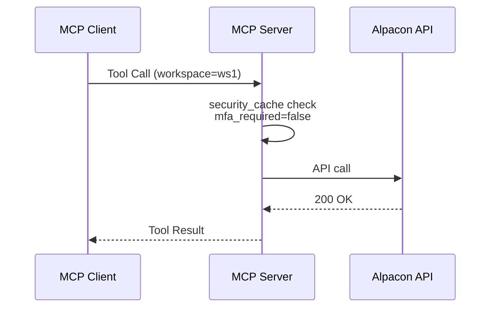
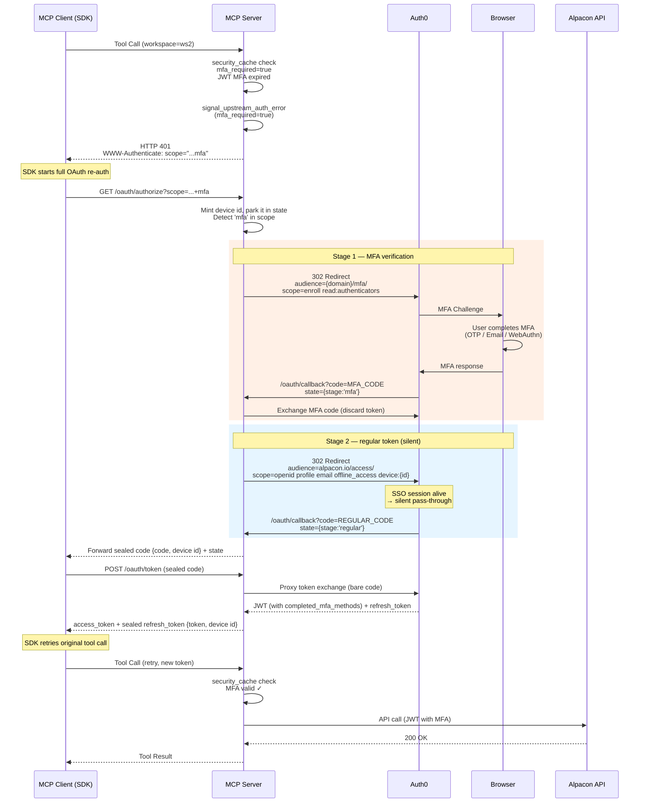
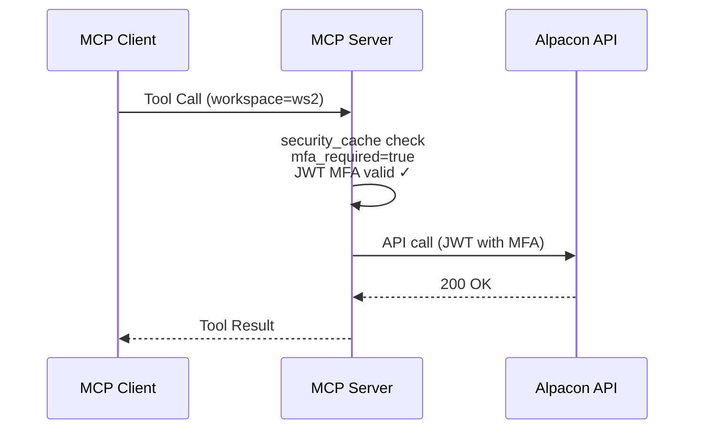

# MFA re-authentication flow for MCP server

This document describes how the MCP server handles workspace-level MFA requirements using a two-stage OAuth flow.

## Overview

Some Alpacon workspaces require MFA for sensitive actions (websh, webftp, command). The MCP server proactively detects this by caching workspace security settings from the account service, and triggers a two-stage OAuth flow when MFA is needed.

## Flow diagrams

### Case 1: MFA not required

```mermaid
sequenceDiagram
    participant C as MCP Client
    participant S as MCP Server
    participant A as Alpacon API

    C->>S: Tool Call (workspace=ws1)
    S->>S: security_cache check<br/>mfa_required=false
    S->>A: API call
    A-->>S: 200 OK
    S-->>C: Tool Result
```

### Case 2: MFA required, not yet completed

```mermaid
sequenceDiagram
    participant C as MCP Client (SDK)
    participant S as MCP Server
    participant A0 as Auth0
    participant B as Browser

    C->>S: Tool Call (workspace=ws2)
    S->>S: security_cache check<br/>mfa_required=true<br/>JWT MFA expired

    S->>S: signal_upstream_auth_error<br/>(mfa_required=true)
    S-->>C: HTTP 401<br/>WWW-Authenticate: scope="...mfa"

    Note over C: SDK starts full OAuth re-auth

    C->>S: GET /oauth/authorize?scope=...+mfa
    S->>S: Mint device id, park it in state<br/>Detect 'mfa' in scope

    rect rgb(255, 240, 230)
        Note over S,B: Stage 1 — MFA verification
        S->>A0: 302 Redirect<br/>audience={domain}/mfa/<br/>scope=enroll read:authenticators
        A0->>B: MFA Challenge
        B->>B: User completes MFA<br/>(OTP / Email / WebAuthn)
        B->>A0: MFA response
        A0->>S: /oauth/callback?code=MFA_CODE<br/>state={stage:'mfa'}
        S->>A0: Exchange MFA code (discard token)
    end

    rect rgb(230, 245, 255)
        Note over S,B: Stage 2 — regular token (silent)
        S->>A0: 302 Redirect<br/>audience=alpacon.io/access/<br/>scope=openid profile email offline_access device:{id}
        Note over A0: SSO session alive<br/>→ silent pass-through
        A0->>S: /oauth/callback?code=REGULAR_CODE<br/>state={stage:'regular'}
    end

    S-->>C: Forward sealed code {code, device id} + state
    C->>S: POST /oauth/token (sealed code)
    S->>A0: Proxy token exchange (bare code)
    A0-->>S: JWT (with completed_mfa_methods) + refresh_token
    S-->>C: access_token + sealed refresh_token {token, device id}

    Note over C: SDK retries original tool call

    C->>S: Tool Call (retry, new token)
    S->>S: security_cache check<br/>MFA valid ✓

    participant API as Alpacon API
    S->>API: API call (JWT with MFA)
    API-->>S: 200 OK
    S-->>C: Tool Result
```

### Case 3: MFA required, already completed (cache hit)

```mermaid
sequenceDiagram
    participant C as MCP Client
    participant S as MCP Server
    participant A as Alpacon API

    C->>S: Tool Call (workspace=ws2)
    S->>S: security_cache check<br/>mfa_required=true<br/>JWT MFA valid ✓
    S->>A: API call (JWT with MFA)
    A-->>S: 200 OK
    S-->>C: Tool Result
```

## Device id per grant

The Auth0 action stores MFA presence under a key named by the `device:<id>` scope and restores the claim from it on refresh. Remote MCP refreshes server-side and stores nothing, so the id has to come back with every refresh: `/oauth/authorize` mints one per grant and parks it in the signed state, `/oauth/callback` seals the code with it, and `/oauth/token` seals every refresh token it returns under the same id and forwards it as `device_id` on every refresh. The client only echoes back what it received.

One id per grant means one MFA record per MCP client installation: a step-up in one client does not refresh another's presence, and a password-only login in one does not clear the record another refreshes against. The sealed value's shape and key are described in [configuration.md](configuration.md).

## Key components

| Component | File | Role |
|-----------|------|------|
| Security settings cache | `utils/security_settings.py` | Caches workspace MFA settings from account service |
| MFA pre-check | `utils/decorators.py` | Checks MFA before API call, signals 401 if needed |
| Auth error middleware | `utils/auth_error_middleware.py` | Adds `mfa` scope to WWW-Authenticate on 401 |
| OAuth proxy (authorize) | `utils/oauth/_authorize.py` | Routes to MFA or regular audience based on scope |
| OAuth proxy (callback) | `utils/oauth/_callback.py` | Handles two-stage callback (MFA → regular) |

## Configuration

| Environment variable | Description | Example |
|---------------------|-------------|---------|
| `ALPACON_ACCOUNT_URL` | Account service base URL | `https://account.alpacax.com` |
| `AUTH0_MFA_AUDIENCE` | Auth0 MFA API audience | `https://{domain}/mfa/` |
| `AUTH0_NAMESPACE` | JWT custom claim namespace | `https://alpacon.io/` |
| `ALPACON_MCP_GRANT_SECRET` | Key that seals codes and refresh tokens (optional; derived from the client secret otherwise) | `openssl rand -hex 32` |
